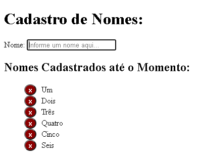

# CRUD de Nomes Usando Evento 🗃

---

<p align="center">
   
</p>

<div align="center">

[](https://github.com/gabiqrm/CRUDwithEvent)<space> <space>[](https://github.com/gabiqrm/CRUDwithEvent/blob/master/LICENSE)<space> <space>[](https://github.com/gabiqrm/CRUDwithEvent/)

</div>

---
## 🔎 Acesso Rápido:
https://gabiqrm.github.io/CRUDwithEvent/

---

## 📋 Sobre:

CRUD desenvolvido durante a aula do professor Rafael Gomide, no Bootcamp Desenvolvimento Fullstack disponibilizado pelo IGTI, que consiste em um crud de eventos, que é possível visualizar e manipular 5 variáveis globais existentes no código e cadastrar nomes, atualizá-los e excluí-los.  

---
## ⚙️ Tecnologias:

```bash
📍 HTML5
📍 JavaScript
📍CSS3
```

---
##  Execução:
```
1. Clonar via prompt de comando o projeto em uma pasta de sua preferência: `git clone https://github.com/CRUDwithEvent`
2. Acessar a pasta principal do projeto via prompt de comando. Ex: `cd CRUDwithEvent`;
3. Na pasta raiz, executar o arquivo: `index.html`
```

---
## 🔗 Contribuições:
```
- Faça o fork do projeto (https://github.com/CRUDwithEvent)
- Crie uma branch para sua modificação (git checkout -b feature/[nome])
- Faça o commit (git commit -am 'Add files [nome]')
- Push (git push origin feature/[nome])
- Crie um novo Pull Request
```
---
## 🔐 Licença:
Esse projeto está sob a licença MIT. Veja o arquivo [LICENSE](LICENSE) para mais detalhes.

---

## 👩🏻‍💻 Desenvolvedora:

Desenvolvido por Gabriela Queiroz ! 💜